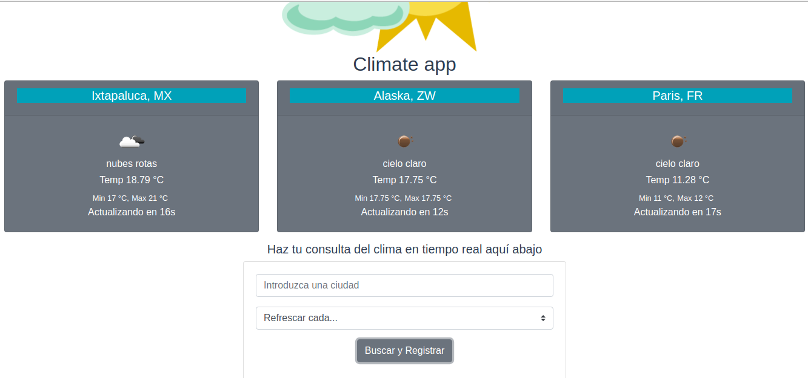
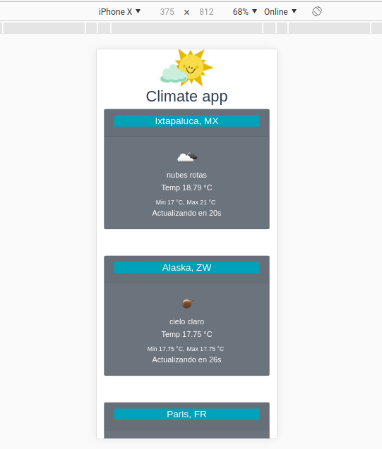

This is the results
-------------------

# Climate app

> A Vue.js project that describe the weather in cities

# Dependencies used

- axios
- bootstrap
- bootstrap-vue
- vue





## Build Setup

``` bash
# install dependencies
npm install

# serve with hot reload at localhost:8080
npm run dev

# build for production with minification
npm run build
```

For detailed explanation on how things work, consult the [docs for vue-loader](http://vuejs.github.io/vue-loader).
